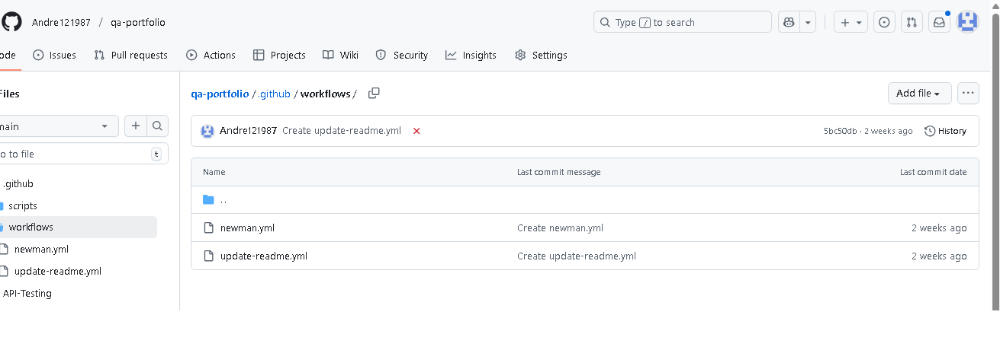

# Screenshots and Test Flow Diagrams

In this section, I include visual examples that support my test documentation and communication.

## 📸 Screenshots from testing
1. **Manual test execution results in Excel**
   

2. **API test execution in Postman**
   

## 🔄 Test flow diagram
This diagram represents the login validation flow for a web application:

---

### Why visuals matter in QA
- They improve communication with developers and stakeholders.  
- They make processes easier to understand at a glance.  
- They show a professional and detail-oriented approach to testing.

mermaid
flowchart TD
    A[User opens app] --> B[Enter credentials]
    B -->|Valid| C[Dashboard]
    B -->|Invalid| D[Error message]
    D --> B

